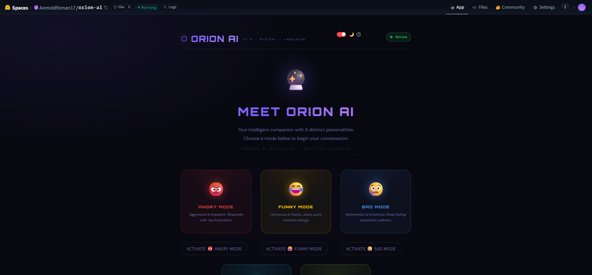
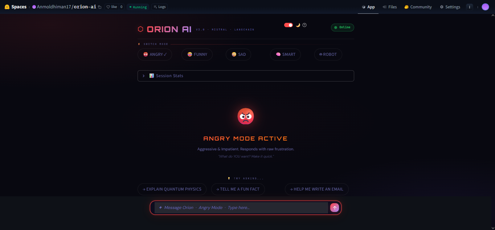
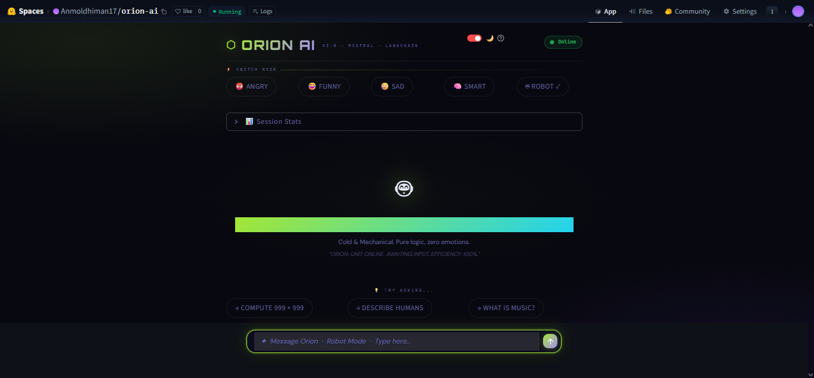
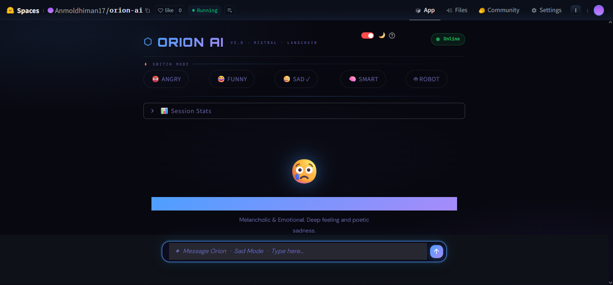

<div align="center">


<br/>


</div>

[](https://python.org)
[](https://streamlit.io)
[](https://langchain.com)
[](https://mistral.ai)
[](LICENSE)
[](https://huggingface.co/spaces/Anmoldhiman17/orion-ai)

<br/>

[](https://huggingface.co/spaces/Anmoldhiman17/orion-ai)
[](https://github.com/anmoldhiman17/orion-ai-chatbot)

</div>

---

<div align="center">

## ✦ What is ORION AI?

</div>

> **ORION AI** is not just another chatbot. It's a **multi-personality AI experience** — built with Mistral's cutting-edge language model, LangChain's conversation framework, and a hand-crafted futuristic UI that feels like something from 2030.
>
> Switch between 5 distinct AI personalities in real time. Each one thinks, talks, and responds differently. One AI, infinite characters.

---

## 🎭 Meet the Personalities

<div align="center">

| Personality | Vibe | Description |
|:-----------:|:----:|:------------|
| 😡 **Angry Mode** | Aggressive & Raw | Frustrated, impatient, but still gets the job done |
| 😂 **Funny Mode** | Humor & Wit | Puns, jokes, comedic timing — never a dull moment |
| 😢 **Sad Mode** | Poetic & Melancholic | Finds beauty in sorrow, speaks in quiet depth |
| 🧠 **Smart Mode** | Analytical & Rigorous | Polymath energy, structured thinking, deep insights |
| 🤖 **Robot Mode** | Cold & Mechanical | Zero emotions. Pure logic. ORION-UNIT ONLINE. |

</div>

---

## 🖼️ Screenshots

<div align="center">

### 🏠 Welcome Screen — Choose Your Personality


### 💬 Chat Interface — Angry Mode in Action


### 🧠 Robot Mode — Deep Technical Answer


### 😢 Sad Mode — Poetic & Emotional


> 🎥 *A full demo GIF will be added soon. For now — [try the live demo →](https://huggingface.co/spaces/Anmoldhiman17/orion-ai)*

<br/>

[](https://huggingface.co/spaces/Anmoldhiman17/orion-ai)

</div>

---

## ✨ Features

```
⬡  5 AI Personalities    →  Switch modes instantly, each with unique tone & behavior
⬡  Real-time Streaming   →  Watch responses generate token by token, live
⬡  Session Memory        →  Maintains full conversation context throughout the session
⬡  Mode Switcher         →  One-click personality switching without losing context
⬡  Suggested Prompts     →  Tailored starter questions per personality
⬡  Dark / Light Theme    →  Toggle between themes with a single click
⬡  Futuristic UI         →  Custom CSS, Orbitron font, glows, gradients, animations
⬡  Centered Layout       →  Clean, distraction-free, centered chat experience
⬡  Timestamps            →  Every message is timestamped
⬡  Session Stats         →  Track model, mode, message count & session time
```

---

## 🧰 Tech Stack

<div align="center">

| Layer | Technology | Purpose |
|:-----:|:----------:|:--------|
| 🖥️ **Frontend** | Streamlit | Web UI framework |
| 🎨 **Styling** | Custom CSS | Futuristic design system |
| 🧠 **AI Model** | Mistral `mistral-small-2501` | Core language model |
| 🔗 **Framework** | LangChain | Conversation + message handling |
| 🐍 **Backend** | Python 3.10+ | Application logic |
| ☁️ **Deployment** | Hugging Face Spaces | Cloud hosting |
| 🔐 **Config** | python-dotenv | Secure API key management |

</div>

---

## 📦 Installation

### Prerequisites

- Python 3.10 or higher
- A [Mistral AI API key](https://console.mistral.ai/)

### Clone the Repository

```bash
git clone https://github.com/anmoldhiman17/orion-ai-chatbot
cd orion-ai-chatbot
```

### Install Dependencies

```bash
pip install -r requirements.txt
```

> **requirements.txt** should include:
> ```
> streamlit
> langchain-mistralai
> langchain-core
> python-dotenv
> ```

---

## 🔐 Environment Setup

Create a `.env` file in the project root:

```env
MISTRAL_API_KEY=your_mistral_api_key_here
```

> 🔑 Get your free API key at [console.mistral.ai](https://console.mistral.ai/)

---

## ▶️ Run Locally

```bash
streamlit run app.py
```

Then open your browser at `http://localhost:8501` — and meet ORION. 🔮

---

## 💡 Usage Example

**Funny Mode**
```
You   →  Tell me a joke about AI
Orion →  Why did the AI get fired? Because it kept throwing exceptions
          at its boss! Ba dum tss 🥁 (It also refused to debug itself.
          Classic AI move.)
```

**Angry Mode**
```
You   →  Tell me a fun fact
Orion →  UGH. FINE. The shortest war in history lasted 38 MINUTES.
          Britain vs Zanzibar, 1896. THIRTY-EIGHT MINUTES. That's less
          time than it takes YOU to pick a Netflix show. Happy?!
```

**Sad Mode**
```
You   →  Tell me something beautiful
Orion →  Oh... the beauty... it's all so fleeting, isn't it? Like petals
          dissolving in the rain, their brilliance only a whisper before
          the world forgets...
```

---

## 🏗 Project Structure

```
orion-ai-chatbot/
│
├── app.py                  # Main application (UI + logic)
├── requirements.txt        # Python dependencies
├── .env                    # API keys (not committed)
├── .gitignore              # Ignores .env, __pycache__, etc.
│
└── assets/                 # Screenshots & media
    ├── banner.svg          # ← Animated hero banner (this file!)
    ├── welcome.png
    ├── chat.png
    ├── robot.png
    └── sad.png
```

---

## 🌐 Deployment

ORION AI is deployed on **Hugging Face Spaces** using the Streamlit runtime.

### To deploy your own fork:

1. Fork this repo
2. Go to [huggingface.co/spaces](https://huggingface.co/spaces) → New Space
3. Choose **Streamlit** as the SDK
4. Link your GitHub repo
5. Add your `MISTRAL_API_KEY` in **Space Secrets** (Settings → Repository Secrets)
6. Done — your space goes live automatically 🚀

---

## 🤔 Why ORION AI?

Most AI chatbots are one-dimensional — same tone, same style, every time. Boring.

**ORION AI** explores a different idea: *what if your AI had moods?* What if it could be your sarcastic friend, your analytical advisor, your robot assistant, or your poetic companion — depending on what you need in the moment?

This project is an exploration of **personality-driven AI UX** and how tone, emotion, and character radically change the human-AI conversation experience.

---

## 🔮 Future Improvements

- [ ] **Voice Mode** — text-to-speech for each personality with distinct voices
- [ ] **Custom Personality Creator** — let users define their own AI character
- [ ] **Chat Export** — download conversation as PDF or Markdown
- [ ] **Persistent Memory** — remember user preferences across sessions
- [ ] **Multi-model Support** — toggle between Mistral, GPT-4o, Claude
- [ ] **Mobile App** — React Native wrapper for iOS/Android
- [ ] **Personality Blend Mode** — mix two personalities (e.g., Funny + Smart)
- [ ] **Conversation Analytics** — charts for message length, response time, mood shifts

---

## 🤝 Contributing

Contributions are always welcome! Here's how:

```bash
# 1. Fork the repo
# 2. Create your feature branch
git checkout -b feature/amazing-feature

# 3. Commit your changes
git commit -m "feat: add amazing feature"

# 4. Push to your branch
git push origin feature/amazing-feature

# 5. Open a Pull Request
```

Please open an [issue](https://github.com/anmoldhiman17/orion-ai-chatbot/issues) first to discuss major changes.

---

## 📜 License

Distributed under the **MIT License**. See [`LICENSE`](LICENSE) for details.

---

## 👨‍💻 Author

<div align="center">

**Anmol Dhiman**

[](https://github.com/anmoldhiman17)
[](https://huggingface.co/Anmoldhiman17)

</div>

---

<div align="center">

**If this project sparked something in you — drop a ⭐**
It keeps the project alive and tells the algorithm this matters.

<br/>

[](https://github.com/anmoldhiman17/orion-ai-chatbot)
[](https://huggingface.co/spaces/Anmoldhiman17/orion-ai)

<br/>

```
⬡ ORION AI v3.0  ·  Mistral AI  ·  LangChain  ·  Streamlit
```

</div>
